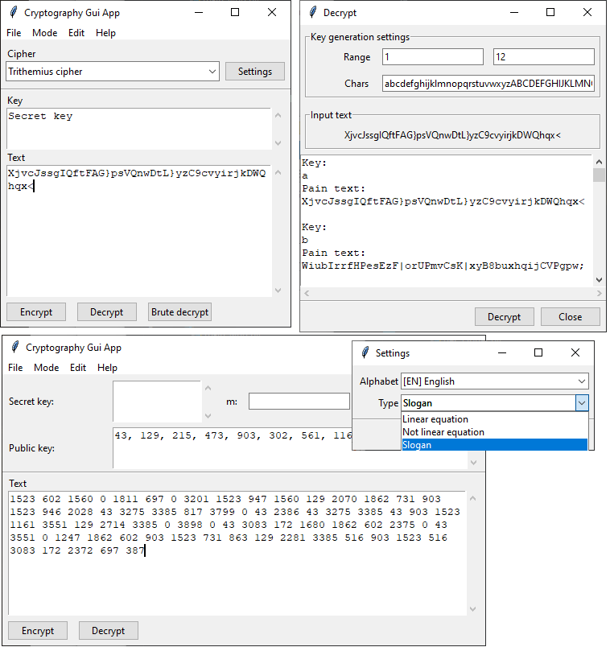

# cryptography-gui-app

An application for encrypting/decrypting text with few symmetric/asymmetric crypto algorithms.

Features:
- Multi alphabet crypt support (English, Ukraine, Russian);
- Symmetric/Asymmetric mode;
- Decrypt brute force iterator;
- Native Tk GUI.

Ciphers:
- Caesar cipher;
- Trithemius cipher (Linear equation/Not linear equation/ slogan);
- Gamma cipher (PRNG based);
- DES (mode CFB);
- Asymmetric cipher (public/private key realization).

## Build Windows Application 

To create runnable execute application use next:
```bash
pyinstaller --onefile --windowed --name cryptography-gui-app app.py
```
[More info about PyInstaller](https://www.pyinstaller.org/)

## Requirements

* Python 3.4 or later
* pycryptodome
* pyinstaller

## Application screenshots


## Support & Contributing
Anyone is welcome to contribute. If you decide to get involved, please take a moment and check out the following:

* [Bug reports](.github/ISSUE_TEMPLATE/bug_report.md)
* [Feature requests](.github/ISSUE_TEMPLATE/feature_request.md)

## License

The code is available under the [MIT license](LICENSE).
